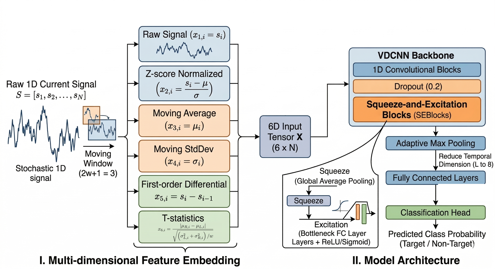

# CAFES: A VDCNN-based tool for fast and accurate nanopore selective sequencing

Nanopore selective sequencing allows the targeted sequencing of DNA of interest using computational approaches rather than experimental methods such as targeted multiplex polymerase chain reaction or hybridization capture. Compared to sequence-alignment strategies, deep learning (DL) models for classifying target and non-target DNA provide large speed advantages. However, the relatively low accuracy of these DL-based tools hinders their application in nanopore selective sequencing. Here, we present a DL-based tool named **CAFES** for nanopore selective sequencing, which takes electric currents with multiple-features embedding as inputs. CAFES employs a modified very deep convolutional neural network (VDCNN) architecture, enabling significantly lower computational costs for training and quicker inference compared to conventional VDCNN. We evaluated the performance of CAFES across ten nanopore sequencing datasets spanning human, yeasts, bacteria, and viruses. 



## Install

### Install CAFES by Conda

#### 1. [Install Conda](https://docs.conda.io/projects/conda/en/latest/user-guide/install/index.html)

#### 2. Download CAFES source code

#### 3. Create Conda virtual environment for CAFES

```shell
conda env create -f environment.yml
conda activate CAFES-env
```


## Quick Start

### Train

```shell
# Enable SEBlock and norm by default, dropout=0.2
python trainer.py -p example/zymo/ -n example/human/ -o example/result/zymo_human -g 0
```

Or with explicit options (same as default):

```shell
python trainer.py -p example/zymo/ -n example/human/ -o example/result/zymo_human -g 0 --dropout 0.2 --SEBlock --norm
```

Set the feature embedding window size used by rolling mean/std and t-stat channels:

```shell
python trainer.py -p example/zymo/ -n example/human/ -o example/result/zymo_human -g 0 --feature_window_size 5
```

### Test

```shell
python tester.py -p example/zymo/ -n example/human/ -ms example/result/zymo_human/model.pth -o example/result/zymo_human/ -g 0
```

## Scripts

### trainer.py

Train the model on the specified dataset.

**Updated Defaults:**
- `--dropout`: 0.2
- `--SEBlock`: Enabled by default (use `--no-SEBlock` to disable)
- `--norm`: Enabled by default (use `--no-norm` to disable)
- `--feature_window_size`: 3, controls rolling mean/std and t-stat feature embedding window size

```shell
usage: trainer.py [-h] --pos_data_folder POS_DATA_FOLDER --neg_data_folder NEG_DATA_FOLDER --output OUTPUT [--preprocess] [--cut CUT] [--tiling_fold TILING_FOLD] [--length LENGTH] [--patches]
                  [--seq_length SEQ_LENGTH] [--stride STRIDE] [--patch_size PATCH_SIZE] [--batch_size BATCH_SIZE] [--epochs EPOCHS] [--learning_rate LEARNING_RATE] [--tolerance TOLERANCE] [--interm INTERM]
                  [--num_workers NUM_WORKERS] [--gpu_ids GPU_IDS] [--dropout DROPOUT] [--SEBlock] [--no-SEBlock] [--norm] [--no-norm] [--feature_window_size FEATURE_WINDOW_SIZE]
```

### tester.py

Test the model on the specified dataset.

**Updated Defaults:**
- `--dropout`: 0.2
- `--SEBlock`: Enabled by default (use `--no-SEBlock` to disable)
- `--norm`: Enabled by default (use `--no-norm` to disable)
- `--feature_window_size`: 3, controls rolling mean/std and t-stat feature embedding window size

```shell
usage: tester.py [-h] --pos_data_folder POS_DATA_FOLDER --neg_data_folder NEG_DATA_FOLDER --model_state MODEL_STATE --output OUTPUT [--batch_size BATCH_SIZE] [--cut CUT] [--length LENGTH] [--patches]
                 [--seq_length SEQ_LENGTH] [--stride STRIDE] [--patch_size PATCH_SIZE] [--gpu_ids GPU_IDS] [--dropout DROPOUT] [--SEBlock] [--no-SEBlock] [--norm] [--no-norm] [--feature_window_size FEATURE_WINDOW_SIZE]
```

### ablation_study.py

Run ablation experiments, including optional feature embedding window-size sweeps.

```shell
python ablation_study.py -trp example/zymo/ -trn example/human/ -tep example/zymo/ -ten example/human/ -o example/result/ablation --window_sizes 3 5 7
```

- `--window_sizes`: one or more feature embedding window sizes for the ablation sweep, default `3 5 7`
- `--exp`: optional experiment name, group, or name prefix; for example, `--exp window_size` runs all window-size experiments

### get_ids.smk

Get the ids of reads that were successfully aligned (mapping quality >= 1) to the reference genome.

```shell
snakemake -s tools/get_ids.smk --config fastq_path={fastq_path} ref_path={ref_path} align_threads=16 output={output_path} --cores 1
```

### read_fast5.py

Constructing training, validation, and testing sets from the fast5 files of nanopore sequencing data.

```shell
python tools/read_fast5.py -dir {fast5_dir} -o {output_path} -ids {read_ids_path}
```

### preprocessor.py (optional)

Perform data preprocessing on training and validation sets from the dataset folder.

```shell
python preprocessor.py -d {dataset_folder}
```

## Acknowledgements

Some code in this repository is adapted from:
- [ReadCurrent](https://github.com/Ming-Ni-Group/ReadCurrent/)
- [Campolina](https://github.com/lbcb-sci/Campolina)
